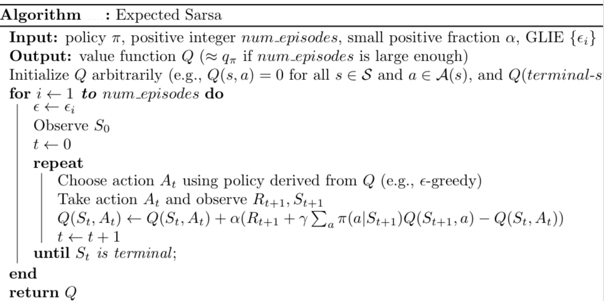

# [Taxi-v3 Problem](https://gym.openai.com/envs/Taxi-v3)

### Introduction

Read the description of the environment in subsection 3.1 of [this paper](https://arxiv.org/pdf/cs/9905014.pdf).  

### Instructions

The repository contains three files:
- `agent.py`: Develop your reinforcement learning agent here.  
- `monitor.py`: The `interact` function tests how well the agent learns from interaction with the environment.
- `main.py`: Run this file in the terminal to check the performance of the agent.

Begin training by running the following command in the terminal:
```
python main.py
```

### Implementation
#### Algorithm
* Expected Sarsa [[Explanation Paper]](http://www.cs.ox.ac.uk/people/shimon.whiteson/pubs/vanseijenadprl09.pdf)

    > Pseudo code of expected sarsa
    
    
    
    > Best Result
    
    Best average reward over 100 consecutive trials : **8.2959**
    
    > Hyperparameters:
    
    `gamma` : `0.87` \
    `alpha` : `0.54` \
    `epsilon_start` : `1.0` \
    `epsilon_decay` : `0.9997`  
    `epsilon_min` : `0.01` \
    `episode numbers` : `20000`
                                                                           
                                                                                     